## Task 1 - Azure Linux VM Setup with SSH and GUI Access

### 🔧 Tool/Command Used:
Azure Portal, Azure CLI, SSH, Remote Desktop Protocol (RDP), XRDP, XFCE4

### 📘 Explanation:
This task involves provisioning a Linux virtual machine in Azure, enabling secure SSH access, installing a desktop environment (XFCE4), and setting up remote GUI access using XRDP and RDP. Azure CLI was used to open the required ports for RDP access.

### 🖼️ Screenshot:
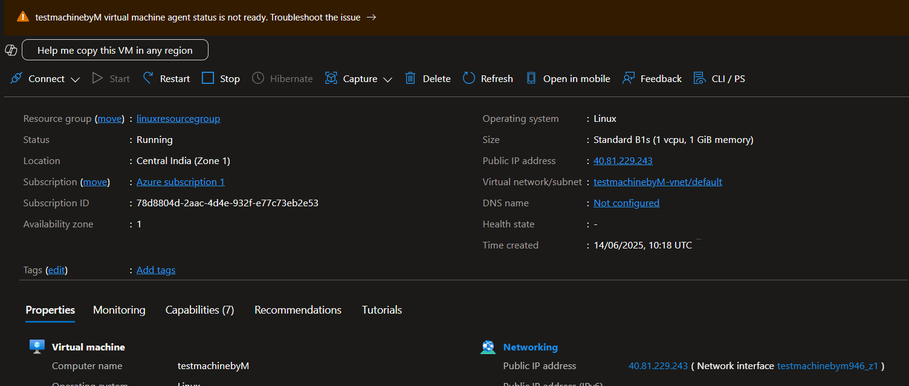

This shows the creation of a Resource Group to logically organize resources. The Azure CLI command `az group create` was used to create the resource group.

---

Linux VM is being created within the resource group via Azure Portal. 

---

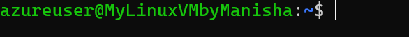

Displays the deployed VM details including public IP and resource name. The public IP is used for RDP access. The resource name is used for SSH access. The Azure CLI command `az vm open-port` was used to open the required ports for RDP.

---

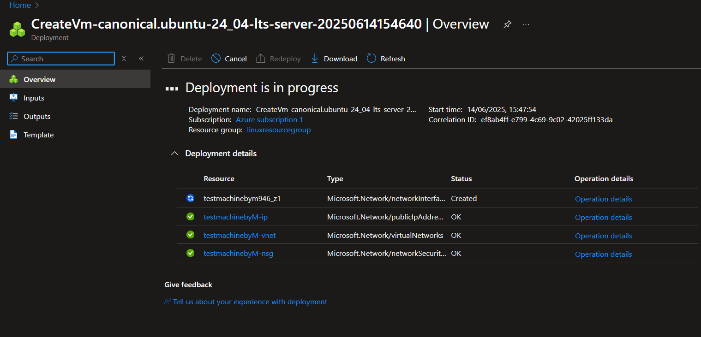

Successful deployment confirmation of the Azure Linux VM. The Azure CLI command `az vm show` was used to verify the VM details. 

---

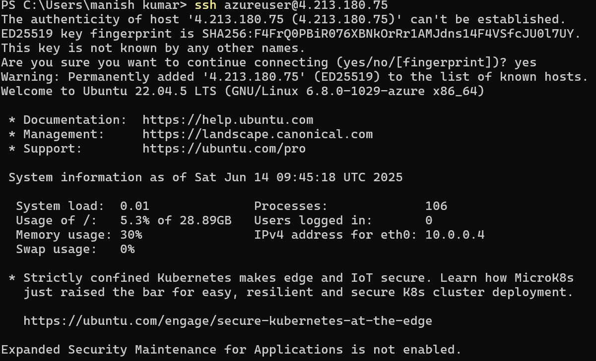

The SSH credentials screen in Azure, showing connection command to access the VM securely. 

---

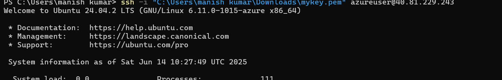

First-time SSH attempt from local terminal to Azure VM using the provided public IP and credentials. The Azure CLI command `ssh-keygen` was used to generate SSH keys. The Azure CLI command `ssh-copy-id` was used to copy the local SSH key to the Azure VM. The Azure CLI command `ssh` was used to establish the SSH connection. 

---

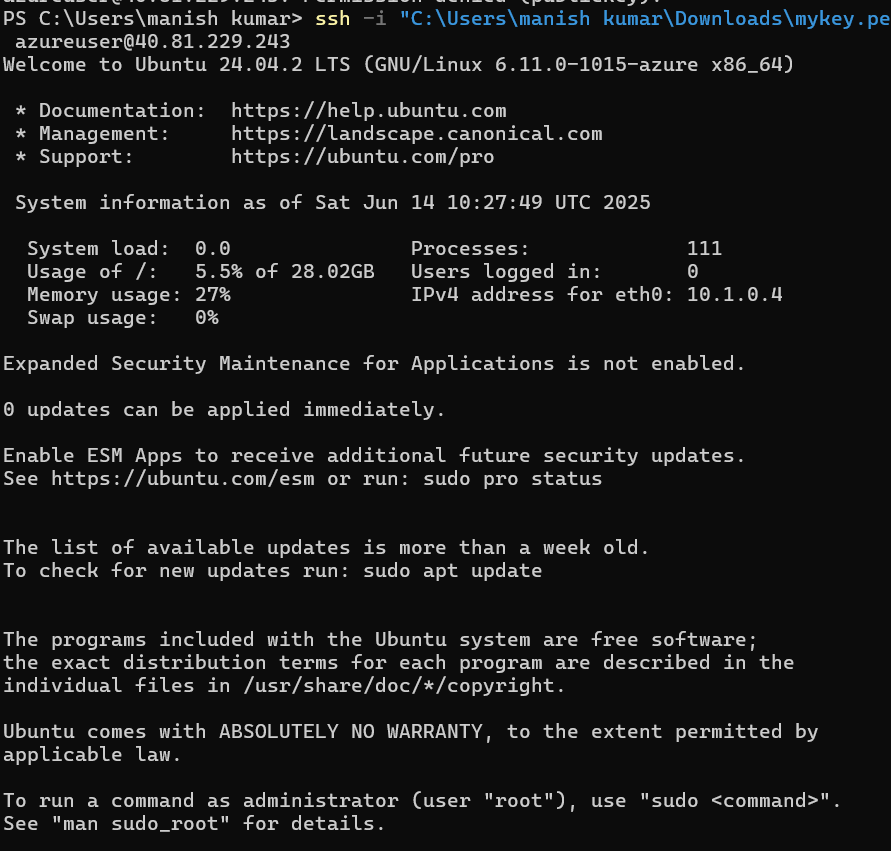

Successful login into the Ubuntu Linux VM using SSH. The Azure CLI command `ssh` was used to establish the SSH connection. 

---

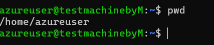

Displays the present working directory inside the SSH session confirming successful login. The Azure CLI command `pwd` was used to display the present working directory. 

---

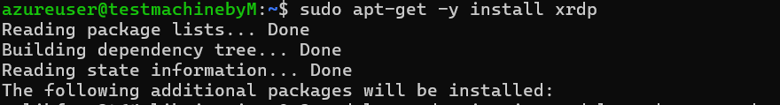

Installation of XRDP package to allow remote desktop connections. The Azure CLI command `sudo apt-get install xrdp` was used to install the XRDP. 

---

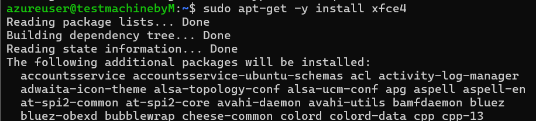

Installation of XFCE4 desktop environment on the Linux VM. The Azure CLI command `sudo apt-get install xfce4` was used to install the xfce4. 

---

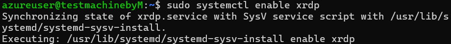

XRDP is enabled and started, and necessary configuration is done to use XFCE4 with XRDP . The Azure CLI command `sudo systemctl enable xrdp` was used to enable XRDP. The Azure CLI command `sudo systemctl start xrdp` was used to start XRDP.  

---

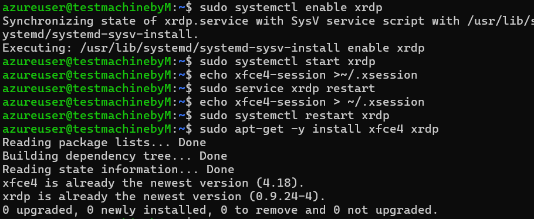

Final setup and configuration of XRDP including restarting the service. The Azure CLI command `sudo systemctl restart xrdp` was used to restart XRDP. The Azure CLI command `sudo systemctl status xrdp` was used to check the status of xrdp.

---

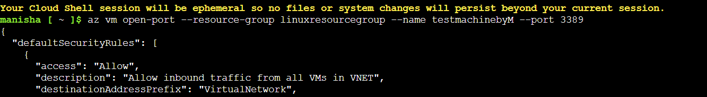

Using Azure CLI to open port 3389 for allowing RDP traffic into the Linux VM. The Azure CLI command `az vm open-port --resource-group myResourceGroup --name myVM --port 3389` was used to open port 3389.   

---

Successfully connecting to the Linux VM GUI using RDP after XRDP and XFCE setup. The Azure CLI command `mstsc /v:public_ip_address:3389` was used to connect to the Linux VM GUI. The Azure CLI command `mstsc` was used to connect to the Linux VM GUI. 
