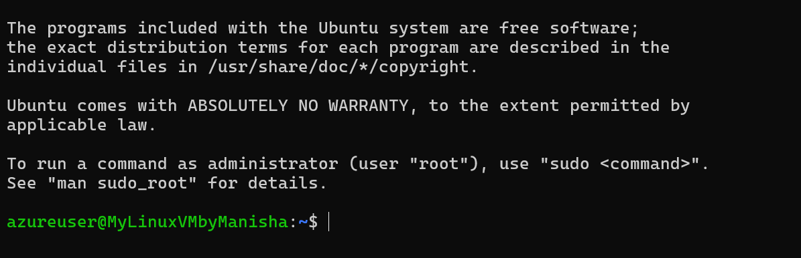
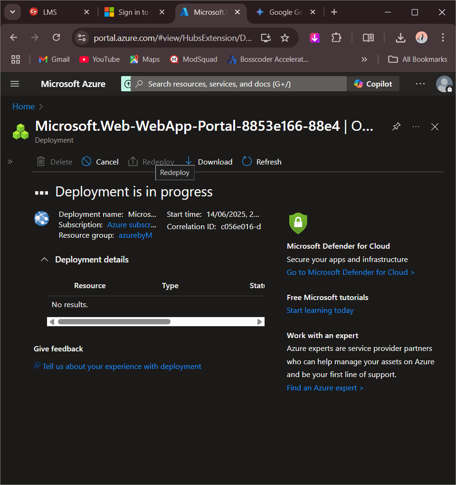
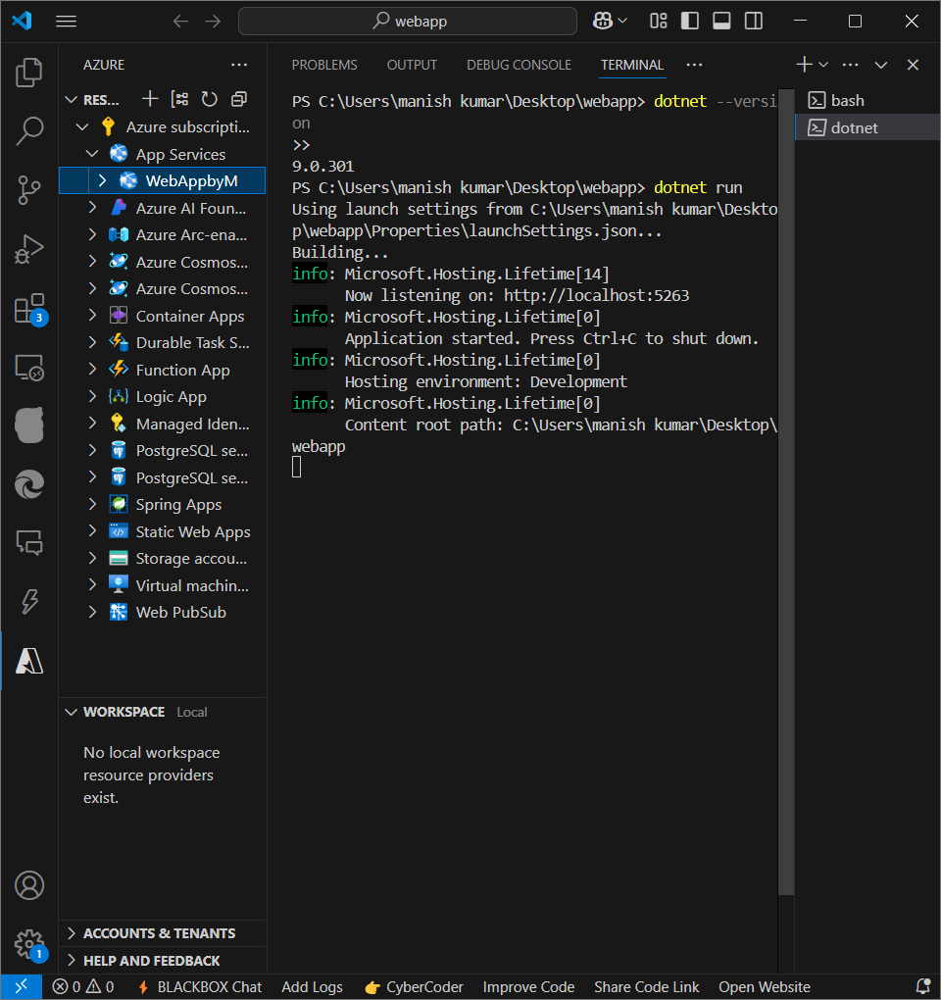
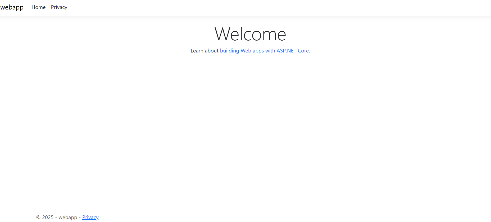

## Task 2 - Deploying a Web App on Azure

### 🔧 Tool/Command Used:
Azure Portal, Azure App Service, Azure CLI, .NET CLI

### 📘 Explanation:
This task covers deploying a simple web application using Azure App Service. The steps include creating the web app via Azure Portal, writing and running a sample .NET application, publishing the app, and finally accessing it via the public Azure URL. Azure CLI and .NET CLI were used for deployment and publishing, while the Portal helped manage the service. The goal is to demonstrate how to deploy a web app on Azure, including setting up the environment, writing the application, and deploying it to the cloud. This task is crucial for understanding how to deploy web applications on Azure, a key skill for cloud computing professionals.

### 🖼️ Screenshot:

This shows the name and details of the Web App being created on Azure. The name must be globally unique as it forms part of the URL. This is a critical step in the deployment process as it ensures the app can be accessed via a unique URL. The Azure Portal provides a user-friendly interface for managing and configuring Azure resources, including creating and managing web apps. This screenshot demonstrates the creation of a new web app, a key step in deploying a web application on Azure.

---

Displays the progress of web app deployment. Azure provisions the app service, sets up the hosting environment, and links it with your subscription. This is a critical step as it ensures the app is deployed correctly and is accessible via the public URL. The Azure CLI and .NET CLI were used to automate the deployment process, making it efficient and scalable. This screenshot shows the deployment progress, including the creation of the app service, setting up the hosting environment. This is a crucial step in the deployment process as it ensures the app is deployed correctly and is accessible via the public URL.

---

Indicates that the web app has been successfully deployed and is now running on Azure infrastructure. This is the final step in the deployment process, confirming that the app is accessible via the public URL. The Azure Portal provides a user-friendly interface for managing and configuring Azure resources, including monitoring the status of deployed apps. This screenshot shows the successful deployment of the web app, a key milestone in the deployment process. This is a critical step as it ensures the app is accessible and running correctly on Azure infrastructure.

---

Shows the execution of the `.NET` app using `dotnet run`. This step ensures the app runs locally without errors before deploying it to Azure. The `.NET` CLI is used to run the app, making it easy to test and debug the application before deployment. This screenshot demonstrates the execution of the `.NET` app, a crucial step in ensuring the app runs correctly before deployment. This is a key skill for cloud computing professionals as it ensures the app is thoroughly tested before deployment to the cloud.

---

Logs of publishing the web app using `dotnet publish`. This prepares the application by building and packaging it for deployment. The `.NET` CLI is used to publish the app, making it easy to automate the deployment process. This screenshot shows the logs of publishing the web app, a critical step in the deployment process. This is a key skill for cloud computing professionals as it ensures the app is properly prepared for deployment to the cloud.

---

Azure CLI output showing successful upload and deployment of the published app to the Azure App Service using commands like `az webapp deploy`. This is the final step in the deployment process, confirming that the app has been successfully deployed to Azure. The Azure CLI is used to automate the deployment process, making it efficient and scalable. This screenshot shows the Azure CLI output, a key step in the deployment process. This is a critical step as it ensures the app is deployed correctly and is accessible via the public URL.

---

The final welcome page that confirms the application has been deployed successfully and is live on the internet using the Azure Web App endpoint. This is the final step in the deployment process, confirming that the app has been successfully deployed and is accessible via the public URL. The Azure Portal provides a user-friendly interface for managing and configuring Azure resources.
