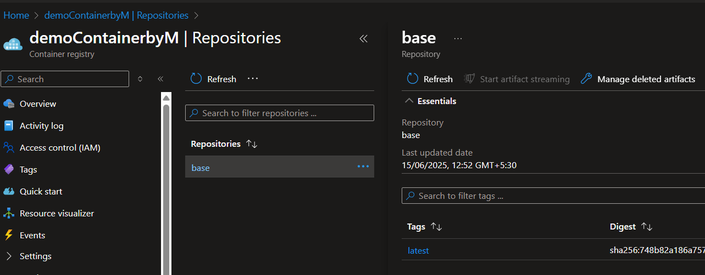
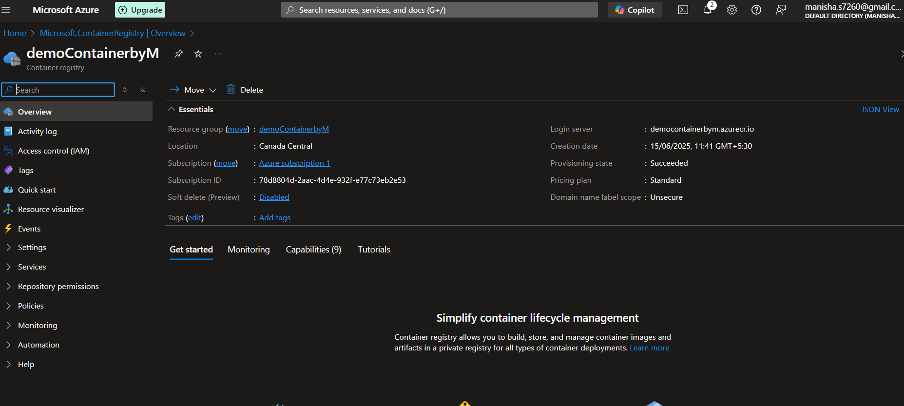
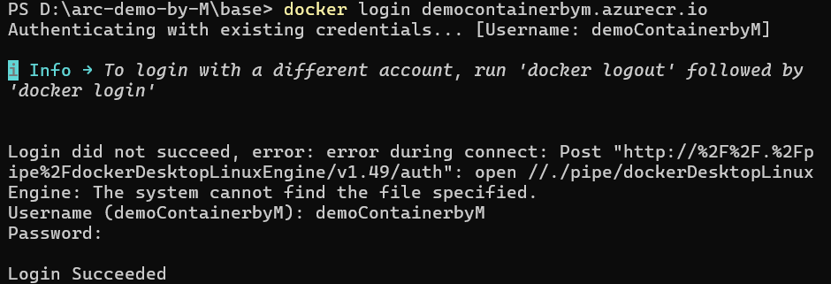
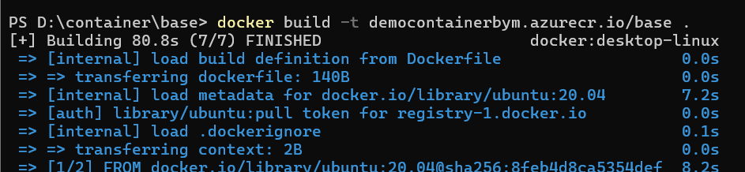
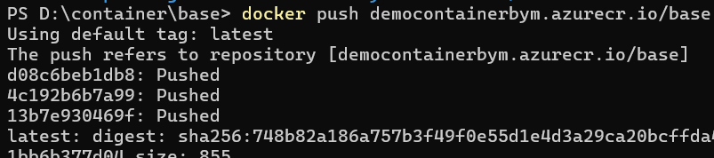
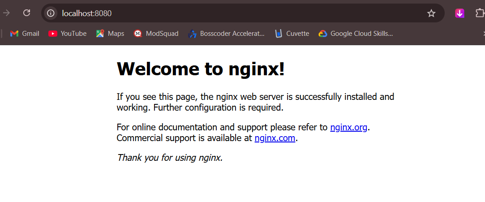

# Task 3: ACR & Docker Container Deployment

## base-rep-in-azure



> I created an Azure Container Registry named `democontainerbym`. This registry will store my custom Docker images, so they can be pulled and used later. I used basic settings like standard pricing and public access with RBAC for permissions. I also created a resource group named `demoreg` to hold all my resources. This is a good practice to keep all related resources in one place for easier management.

---

### demo-container



> After pulling my Docker image from ACR, I used it to create and run a container locally. I exposed port 8080 to serve the application (in this case, NGINX). The container is now running successfully. I can access it by visiting `http://localhost:8080` in my web browser.

---

### docker-login



```bash
docker login democontainerbym.azurecr.io
```

> This command is used to log into my Azure Container Registry using Docker. Logging in is important because without it, I wouldn’t be able to push or pull images from the registry. I used the command `docker login democontainerbym.azurecr.io` to log in with my credentials.

---

### docker-build



```bash
docker build -t democontainerbym.azurecr.io/base .
```

> This command builds a Docker image from the Dockerfile present in my current directory. I tagged the image with my ACR path so it can be pushed to the registry later. The image installs and runs NGINX. The `.` at the end of the command tells Docker to look for the Dockerfile in the current directory.

---

### docker-push



```bash
docker push democontainerbym.azurecr.io/base
```

> After building the image, I pushed it to my Azure Container Registry. This step makes the image available online so it can be pulled and used anywhere with access. I used the command `docker push democontainerbym.azurecr.io/base` to push the image to the registry.

---

### nginx



> This is the NGINX welcome page, which confirms that my container is running and serving content correctly. I accessed it through `http://localhost:8080`, which is the port I mapped during the container run step. This is a basic test to ensure my container is working as expected.
