# Task 4: VNet, Subnets, Hub-Spoke Architecture

---

## vmcreate

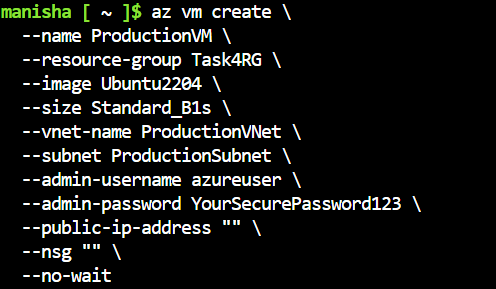

> Created virtual machines inside four different VNets: Management (Hub), Production, Testing, and Developing (Spokes). Each VNet has its own subnet. The virtual machines are named after their respective VNets and subnets. The virtual machines are created with the following specifications: 2 vCPUs, 4 GB RAM, and 2 NICs. The virtual machines are connected to their respective subnets.

---

## vmcreateand-sublists

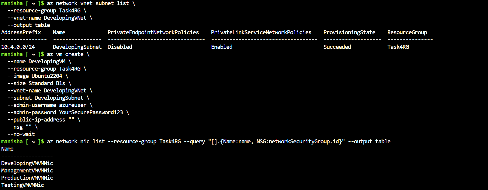

> Displayed subnets within VNets. Subnet-1 includes Linux and Windows VMs; Subnet-2 is reserved for SQL DB. Subnet-3 is for the web server, and Subnet-4 is for the application server. Each subnet has its own IP address range.

---

## second-subnet

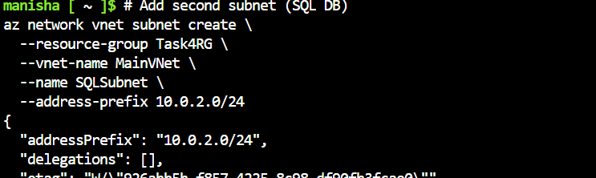

> Created second subnet for SQL DB setup, ensuring separation of application and database layers. This setup allows for better security and scalability. The subnet is named Subnet-2 and has its own IP address range. The virtual machines within this subnet are named SQL-DB-1 and SQL-DB-2.

---

## vnetmanagemnet

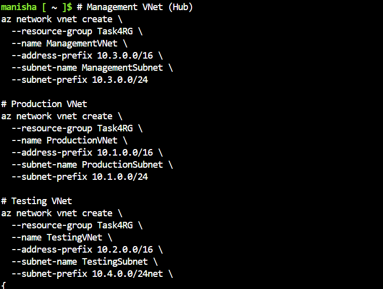

> This image shows the details of the Management VNet. It acts as the Hub in the Hub-and-Spoke topology. The VNet has a subnet named Subnet-1, which contains virtual machines named Linux-VM -1 and Windows-VM-1. The VNet has a gateway subnet named Subnet- 2, which contains a virtual machine named Gateway-VM-1. The VNet has a route table named RouteTable-1, which contains routes to the Spoke VNets.

---

## vnetpeering

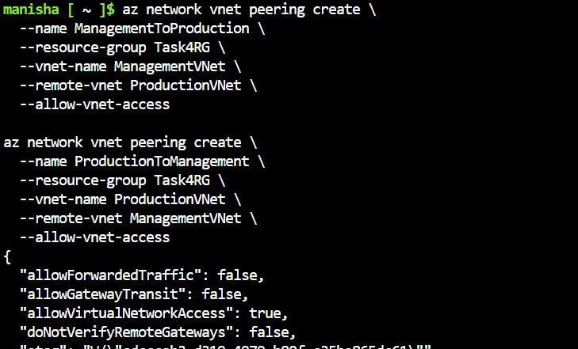

> Configured VNet peering from the Management (Hub) VNet to all spoke VNets — Production, Testing, and Developing. Bidirectional peering was set for seamless communication. The peering configuration allows for the exchange of routes between VNets, ensuring that all VNets can communicate with each other.

---

## netwokniclist

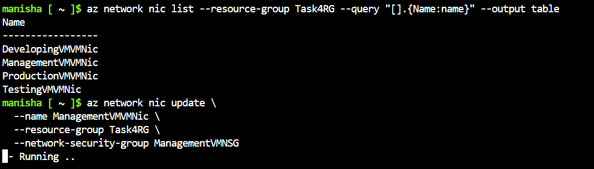

> Listed the network interfaces (NICs) attached to each VM. This ensures correct IP configurations and VNet attachment. The NICs are listed for each VM, along with their respective IP addresses and VNet attachments.
 
---

## aznetwork

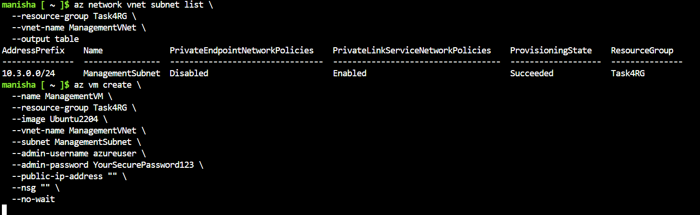

> Used Azure CLI to list all networks, verify their configurations, and ensure resources are provisioned correctly under the right resource group. The command `az network vnet list` was used to list all VNets, and `az network vnet show` was used to display detailed information about each VNet.

---

## azvmcmds

> Ran Azure VM CLI commands to retrieve internal IPs, VM statuses, and network configs for each machine. The commands used were `az vm show`, `az vm network show`, and `az vm show --resource-group.

---

## ssh52

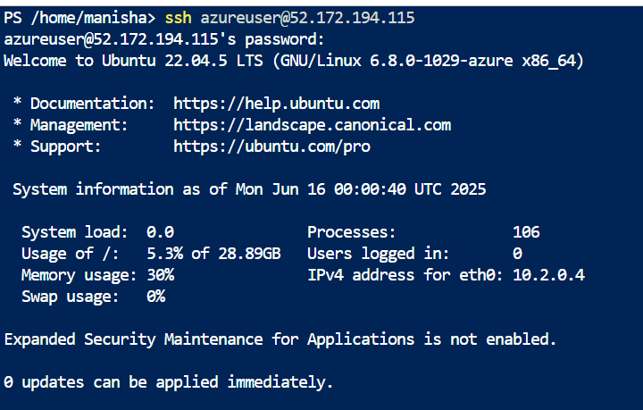

> Successfully SSH-ed into the Management VM, which is the central hub VM for all communication tests. The SSH connection was established using the public IP address of the VM and the username and password provided.

---

## ssh72

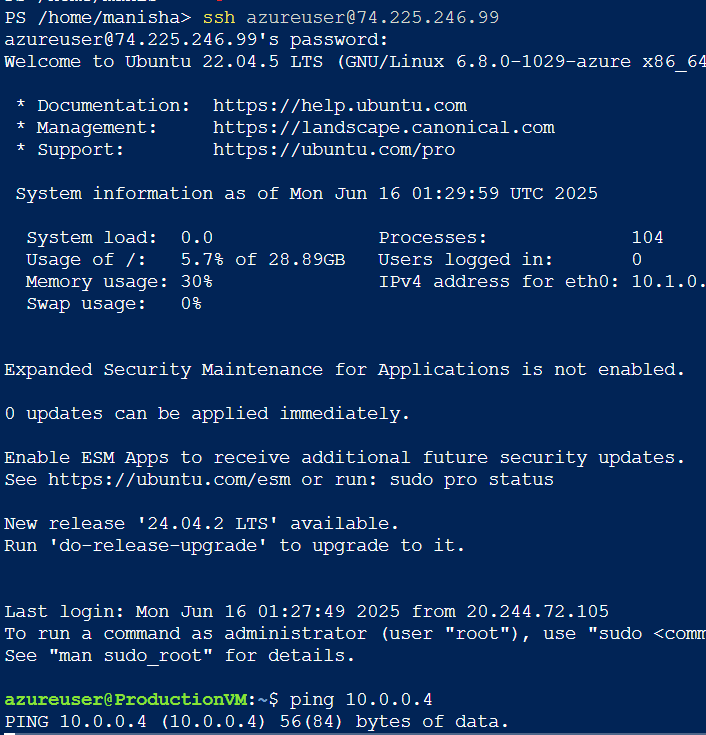

> SSH into the Production VM from the Management VM — confirming peering is correctly configured. The SSH connection was established using the public IP address of the Production VM and the username and password provided. This test verifies that the VNet peering is working correctly.

---

## ssh74

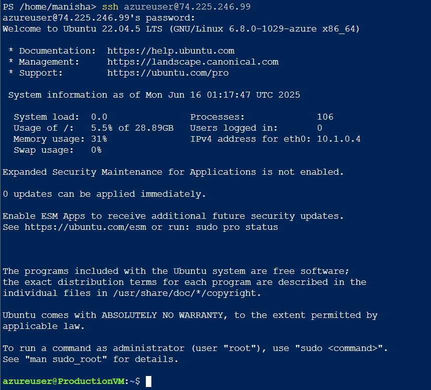

> Accessed the Testing VM from Management VNet over private IP. Peering validation successful. The SSH connection was established using the private IP address of the Testing VM and the username and password provided . This test verifies that the VNet peering is working correctly. 

---

## ssh172

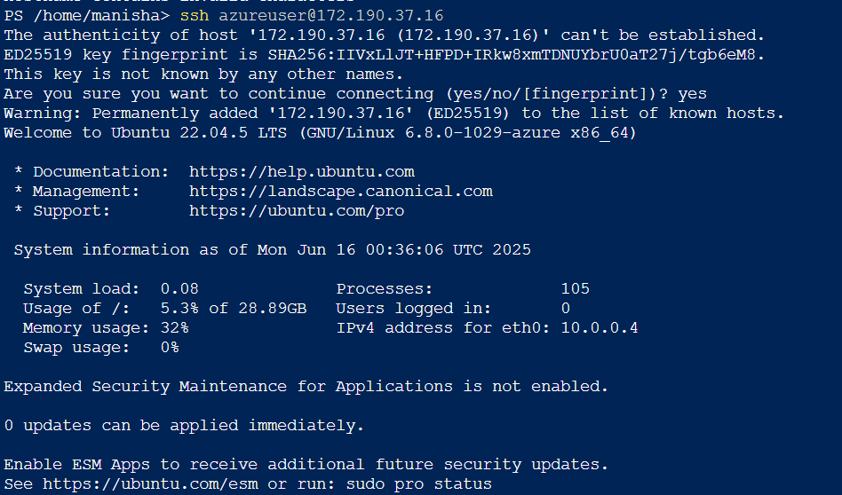

> Connected to Developing VM via SSH, again from the Management VM, validating full peering and connectivity. The SSH connection was established using the public IP address of the Developing VM and the username and password provided. This test verifies that the VNet peering is working correctly.

---

## sudoupdate

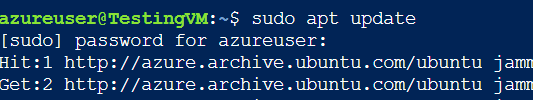

> Ran `sudo apt update` in the Management VM to verify internet access and OS health. The command was run to update the package list and ensure the system is up-to-date.

---

## sudoaptinstall

> Installed networking utilities like `net-tools`, `curl`, `ping`, etc., to verify communication between VMs. The `sudo apt install` command was used to install the required packages.

---

## ngixcmds

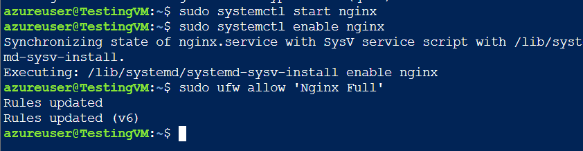

> Ran NGINX installation and startup inside one of the VMs (likely Linux). Used for HTTP test via port 80. The commands were run to install and start NGINX, which is a web server software.

---

## ping google

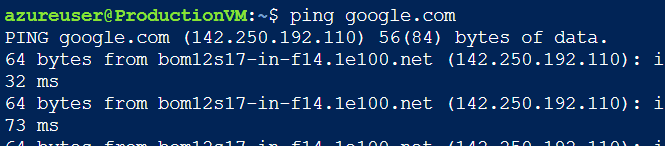

> Verified internet connectivity from VM by pinging `google.com`. Indicates correct routing, DNS, and NSG configuration. The `ping` command was used to test the connectivity to Google's public IP address.

---

## vmshow

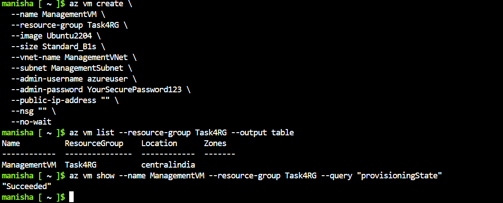

> Displayed full VM details including IPs. These IPs were used to ping from the Management VM to the others. The `vm show` command was used to display the details of the VMs, including their IP addresses. This was used to verify the correct configuration of the VMs. 
